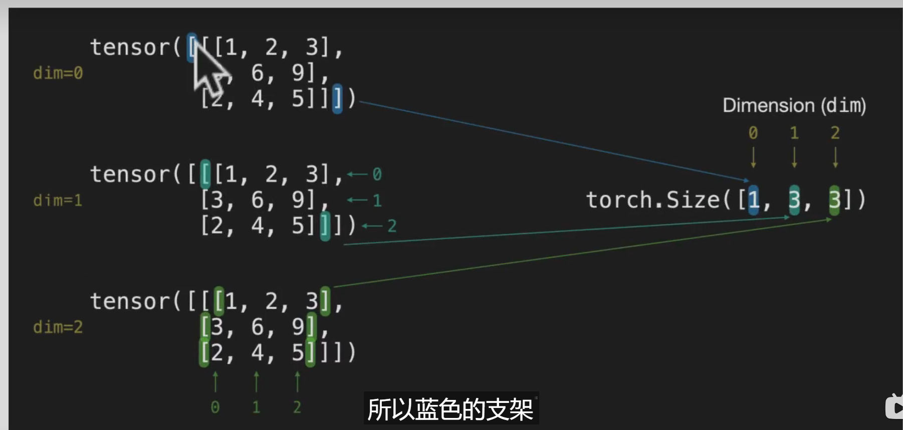

# 1. 基础
## 1.1. 环境配置

## 1.1.1 使用colab.research.google.com真的好用，赞！  
## 1.1.2 ctrl+m m转换代码为文本  
## 1.1.3  导包几件套  
```python
import torch  
import pandas as pd  
import numpy as np  
import matplotlib.pyplot as plt  
```
# 1.2. 标量、向量、矩阵、张量  

## 1.2.1 标量，比如torch.tensor(2)  
### 1.2.1.1 维度ndim  
```python
scalar = torch.tensor().ndim，标量没有维度  
```
### 1.2.1.2 获取原本数值  
```python
torch.tensor().item()  
```
## 1.2.2 向量（矢量）
```python
比如torch.tensor([7,7])  
```
### 1.2.2.1 ndim  
ndim为1
### 1.2.2.2 shape
shape为2，为向量里面的元素个数  

## 1.2.3 矩阵Matrix
```python
比如MATIX = torch.tensor([[7, 8]  
                        [9, 10]])
```
### 1.2.3.1 MATIX.ndim 为2  
### 1.2.3.2 MATIX[0]
torch.tensor([7, 8])  
### 1.2.3.3 MATIX.shape 
torch.Size([2, 2])  

## 1.2.4 张量 tensor
```python
TENSOR = torch.tensor(  
    [[[1, 2, 3],  
    [3, 6, 9],  
    [2, 4, 5]]]  
)
```
### 1.2.4.1 TENSOR.ndim = 3
### 1.2.4.2 TENSOR.shape = torch.Size(1,3,3)

### 1.2.4.3 random tensors
torch.rand()  
对于图片来讲，可以表示为3个通道，每个通道为 

torch.tensor([height, width])  
torch.tensor(height, width)  
torch.tensor(size=(height, width))


### 1.2.4.4 全部是0或者全部是1的张量   
```python
zero = torch.zeros(size=(3, 4))  
```
清除一个张量直接tensor*zero就把原来的tensor清除了，就都是0了  
```python
ones = torch.ones(size(3, 4))
```
数据类型dtype，
```python   
ones.dtype = torch.float32
```
# 1.3. 创建range
## 1.3.1. troch.arange()  
torch.arange(start, end ,step)和原生range一样
```python
one_to_four = torch.arange(0, 4)
# 会得到
tensor([0, 1, 2, 3])
```
形成一个维度一样的全0矩阵
```python
torch.zeros_like(input=one_to_four)
# 会得到
tensor([0, 0, 0, 0])
```

## 1.3.2. 数据类型  
常见的pytorch中的错误：  
tensor类型错误，使用.type  
tensor形状错误，使用.size()或.shape  
tensor没在正确的device上，使用.device    

创建张量预选有几个选项比较重要， 分别是dtype, device, requires_grade
```python
float_32_tensor = torch.tensor([3.0, 6.0, 9.0]，
                                dtype=None,
                                device=None,
                                requires_grad = False)
#改变数据类型
float_16_tensor = float_32_tensor.type(torch.float16)                            
```
### 1.3.2.1. dtype
默认为 torch.float32, 可以强制更改为torch.float16等
.dtype来看数据类型

### 1.3.2.2. device
device可以是cpu，也可以是cuda，默认是None
```python
# 可以用
tensor.device()获取
```

## 1.3.3. 计算tensor

### 1.3.3.1. addition
创建一个tensor
```python
tensor = torch.tensor([1, 2, 3])
# 执行加标量运算
tensor + 10
# 结果为
tensor([11, 12, 13])

# 内置加法
torch.add(tensor, 10)
# 结果为
tensor([11, 12, 13])

```

### 1.3.3.2. subtraction
```python
# 执行减标量运算
tensor - 10
# 结果为
tensor([-9, -8, -7])
```
### 1.3.3.3. multiplication(element-wise)元素乘法
```python
# 执行乘法
tensor * 10
# 结果为
tensor([10, 20, 30])

# 也可以使用内置乘法
torch.mul(tensor, 10)
# 结果为
tensor([10, 20, 30])
```

### 1.3.3.4. 除法
### 1.3.3.5. 矩阵乘法
```python
# 执行矩阵乘法运算
torch.matmul(tensor, tenosr)
# 结果为
14
# 或者使用@
tensor @ tensor
# 结果为
14
# 或者使用torch.mm
torch.mm(tensor, tensor)
# 结果为
14
```
发现个很有意思的讲矩阵的网站http://matrixmultiplication.xyz/  

## 1.3.4. 转置
tensor.T为tensor的转置  
## 1.3.5. min, max, mean, sum等
针对向量
```python
x = torch.arange(0, 100, 10)
```
### 1.3.5.1. find min
```python
torch.min(x)
# 或者
x.min()
```
### 1.3.5.2. find max
```python
torch.max(x)
# 或者
x.max()
```
### 1.3.5.3. find mean
mean不能处理int类型向量
```python
torch.mean(x.type(torch.float32))
# 或者
x.type(torch.float32).mean()
```
### 1.3.5.4. find the sum
```python
torch.sum(x), x.sum()
```
### 1.3.5.5. find the positional min and max
```python
# find min
x.argmin()
# result
tensor(0)
# find max
x.argmax()
# result
tensor(9)
```
# 1.4. 改变形状
```python
# create tensor
x = torch.arange(1., 11.)
# result
tensor([1., 2., ... 10.])
# shape
x.shape
# result
torch.Size([10])
```
## 1.4.1. reshaping
维度必须一致
```python
x.reshape(10,1)
x.shape
# result
tensor([[1.],
        [2.],
        ...
        [10.]]),
torch.Size([10,1])       
# another reshape
x.reshape([5, 2])
# result
tensor([[1.],[2.],
        ...
        [1.],[10.]]),
```
## 1.4.2. view
调整形状，共享相同内存的，改变z就会改变x，纯纯浅拷贝的感觉
```python
x = torch.arange(1., 10.)
x, x.shape
tensor([1., 2., ... , 9.])
torch.Size(9)
# result
z = x.view(1, 9)
z, z.shape
# result
tensor([[1., 2., ... , 9.]])
torch.Size([1, 9])
```
## 1.4.2. stack
把一堆向量堆成一个矩阵，dim是堆叠方向
```python
x_stacked = torch.stack([x, x, x, x], dim = 0)
# result
tensor([[1., 2., ... 8., 9.],
        [1., 2., ... 8., 9.],
        [1., 2., ... 8., 9.],
        [1., 2., ... 8., 9.]])
# dim=1的堆叠方式
x_stacked = torch.stack([x, x, x, x], dim = 1)
# result
tensor([[1., 1., 1., 1.],
        [2., 2., 2., 2.],
        ...,
        [9., 9., 9., 9.]])
```
## 1.4.3. squeezing and unsqueezing tensors.
squeeze把一个多维的矩阵挤成一个向量，unsqueeze 增加维度
```python
x = torch.arange(1., 10.)
z = x.view(1, 9)
z, z.shape
# result
tensor([[1., 2., ... , 9.]])
torch.Size([1, 9])
# squeeze一下
z.squeeze(), z.squeeze().shape
# result
tensor([1., 2., ... , 9.])
torch.Size([9])
# unsqueeze一下，dim=0
z_unsqueezed = z.squeeze().unsqueeze(dim=0)
# result
tensor([[1., 2., ... , 9.]])
# shape
tensor([1, 9])
# unsqueeze一下，dim=1
z_unsqueezed = z.squeeze().unsqueeze(dim=1)
# result
tensor([[1.], 
        [2.], 
        ... , 
        [9.]])
# shape
tensor([9, 1])
```
## 1.4.4. permute
permute的功能是交换维度，与view一样，改变里面数据会改变原来的数据。
```python
x_orginal = torch.rand(size(224, 224, 3))
# x_orginal是一个三维的张量
# 进行permute变换
x_permuted = x_original.permute(2, 0, 1)
# 这个permute代表轴从2->0, 0->1, 1->2, 轴从0开始算。
```
## 1.4.5. 索引
跟numpy一样

## 1.4.6. 跟numpy的转换
主要说一下数据类型，from_numpy()和numpy()的用法，如果直接转换，tensor的arange是32位，numpy的arange是64位，如果强制转换的话，就from_numpy().type('float32')
### 1.4.6.1. numpy to tensor
```python
array = np.arange(1.0, 8.0)
tensor = torch.from_numpy(array)
# 数据类型
array.dtype
# result
dtype('float64')
# tensor.dtype
tensor.dtype
# result
dtype('torch.float64')
# 如果是直接用torch.arange的数据，就是float32
torch.arange(1.0, 8.0).dtype
# result
torch.float32
```
### 1.4.6.2 tensor to numpy
同上，其实没啥

## 1.4.7. reproducbility(从随即中剔除随机)
即选种子
```python
# 纯随机
torch.rand(3,3)
# 使用种子
RANDOM_SEED = 42
torch.manual_seed(RANDOM)
random_tensor_C = torch.rand(3, 4)
random_tensor_D = torch.rand(3, 4)
# 这样两个张量就完全一致
print(random_tensor_C == random_tensor_D )
# result
tensor([[True, True, True, True],
        [True, True, True, True],
        [True, True, True, True]])
```
# 1.5. GPU加速
## 1.5.1. 使用GPU
```python
# 查询GPU命令
!nividia-smi
# 检查GPU是否可用
torch.cuda.is_available()
# 设置使用GPU
device = "cuda"
# 查询GPU设备数量，离谱，有一个就不错了
torch.cuda.device_count()
```
## 1.5.2. 在GPU上使用tensor
```python
# 默认创建tensor，在cpu上
tensor = torch.tensor([1, 2, 3])
print(tensor.device)
# result
"cpu"
# move tensor to GPU, 因为之前device已经设置为cuda了
tensor_on_gpu = tensor.to(device)
tensor_on_gpu 
# result
tensor([1, 2, 3], device='cuda:0')
# numpy只在cpu工作，把向量移动回cpu，然后变成numpy
tensor_back_on_cpu = tensor_on_gpu.cpu()
numpy_back = tensor_back_on_cpu.numpy()
numpy_back
# result
array([1, 2, 3])
```
# 2.开始训练模型
总共分为6步，准备数据，建立模型，拟合模型，预测与评估，保存模型，使用模型
```python
import torch
from torch import nn
# nn 包含所有的建立神经网络块的信息
import matpotlib.pyplot as plt

# 检查版本
torch.__version__
```
## 2.1 准备数据 data (prepare and load)
从线性拟合开始学

```python
# create *known* parameters
weight = 0.7
bias = 0.3

# create
start = 0
end = 1
step = 0.02
X = troch.arange(start, end ,step).unsqueeze(dim=1)
y = weight * X + bias

X[:10], y[:10]
# result
tensor([[0.00],
        [0.02],
        ...,
        [0.18]]),
tensor([[0.300],
        [0.314],
        [0.328],
        ...,
        [0.426]])

```
### 2.1.1 切分数据
将数据分为训练集和测试集
training set, validation set, test set
切80%用于训练集
```python
train_split = int(0.8 * len(X))
# result
40
# 最简单的切片式分割
X_train, y_train = X[:train_split], y[train_split:]
X_test, y_test = X[:train_split:], y[train_split:]
```
### 2.1.2 可视化数据
最简单的
```python
plt.figure(figsize=(10, 7))
# plot training data in blue
plt.scatter(train_data, train_labels, c="b", s=4)
plt.scatter(test_data, test_labels, c="g", s=4)
# s值散点图大小size
# show the legend
plt.legend(prop={"size": 14})
```
## 2.2 build model
requeires_grad = True意味着要跟踪梯度，实现梯度下降，反向传播  
torch.nn 包含最基本的计算单元  
torch.nn.Parameter - 模型需要的参数  
torch.nn.Module 人工网络基类，应该有forward()方法
torch.optim 优化器，帮助梯度优化  
torch.utils.data.Dataset和torch.utils.data.DataLoader与数据导入有关，复杂数据导入需要，现在还用不到
```python
# Create linear regression model class
from torch import nn
class LinerRegressionModel(nn.Module):
        # nn.Module是所有网络的基类，这里的初值设置不一定是randn(1)，也可以指定初值，比如0
        def __init__(self):
               super(LinerRegressionModel, self).__init__()
                self.weight = nn.Parameter(troch.randn(1,
                requires_grad = True,
                dtype = torch.float))
                
                self.bias =  nn.Parameter(troch.randn(1,
                requires_grad = True,
                dtype = torch.float))
                
        def forward(self, x: troch.Tensor) -> troch.Tensor:
                return self.weights * x + self.bias

# 为了保持一致所以先设定随机种子
torch.manual_seed(42)
# 创建模型实例
model_0 = LinearRegressionModel()
# 查看模型参数
list(model_0.parameters)
# result
[Parameter containing:
tensor(0.3367, requires_grad=True)]
[Parameter containing:
tensor(0.1288, requires_grad=True)]
# 也可以使用model_0.state_dict()查看
OrderDict((('weight', tensor([0.3367])), 'bias', tensor([0.1288])))
```
## 2.3 train model训练
### 2.3.1 设置loss和optimizer
首先设置损失函数loss function  
nn.MSELoss 均方误差
nn.L1Loss 误差绝对值和，简称MAE  
线性回归这里直接简单粗暴，使用绝对值误差和就完事了  
optimizer优化器也有各种函数，要挑选的，这里使用SGD(stochastic gradient descnet)，参数是lr学习率  
最后要进行迭代循环，training loop
```python
# 设置loss 函数
loss_fn = nn.L1Loss()
# 设置optimizer
optimizer = torch.optim.SGD(params = model_0.parameters(),
lr=0.01)
```
### 2.3.2 进行loop
0. loop through the data
1. Forward pass to make predictions on data
模型前传，会执行forward命令，正向传播
2. calculate the loss
计算损失值
3. optimizer zero grad
优化器梯度归零，当使用优化器step时，梯度会随时间推移而累积
4. loss backward
反向传播loss，根据loss执行反向传播，根据requires_grad=true，计算每个参数
5. optimizer step
课程不涉及反向传播，和优化的数学原理，要想知道数学原理就还得自己去看别的视频

test部分
#### 训练模式和评估模式
使用eval()关闭训练模式，

turns off different settings in the model not needed for evaluation/testing (dropout/batch norm layers)在模型的评估（或测试）阶段，会关闭那些对于评估或测试过程不需要的设置，特别是针对Dropout层和BatchNorm层的行为进行调整。

<!-- Dropout层：在训练过程中，Dropout层通过随机丢弃一部分神经元的输出来防止模型过拟合。但在评估或测试阶段，我们不再需要这种正则化效果，因为此时我们想要模型充分利用所有可用的信息来做出最准确的预测。因此，在评估模式下，Dropout层会被“关闭”，即所有神经元的输出都会被保留。
BatchNorm层：BatchNorm层在训练过程中会根据每个小批量的数据来计算均值和方差，并进行归一化处理。但在评估或测试阶段，我们希望模型能够使用在整个训练集上计算的均值和方差来进行归一化处理，以确保模型在不同数据集上的表现一致。因此，在评估模式下，BatchNorm层会使用这些全局的均值和方差，而不是每个小批量的均值和方差。
通过关闭这些在评估或测试阶段不需要的设置，我们可以确保模型在评估或测试时能够表现出最佳的性能，同时避免由于训练特有的正则化效果而导致的预测偏差。这是深度学习模型在实际应用中的一个重要步骤，有助于提高模型的准确性和可靠性。
参考：
在PyTorch中，model.eval() 和 model.train() 是用来控制模型在不同阶段的行为的方法。它们主要影响那些在训练和评估（或推理）阶段表现不同的层，比如批归一化（BatchNorm）层和丢弃（Dropout）层。下面是两个方法的主要区别：

model.train()
用途：将模型设置为训练模式。
行为：
对于 Dropout 层：在训练模式下，Dropout 层会按照设定的概率随机“丢弃”（即设置为零）一部分输入，以防止过拟合。
对于 BatchNorm 层：在训练模式下，BatchNorm 层会根据当前批次的数据计算均值和方差，并使用这些值进行归一化。同时，它还会累积整个训练集的均值和方差，以便在评估时使用。
梯度：在训练模式下，默认情况下会计算梯度，这是为了能够通过反向传播更新模型参数。
适用场景：当你准备开始训练模型或者正在进行训练时，应该使用 model.train()。
model.eval()
用途：将模型设置为评估模式。
行为：
对于 Dropout 层：在评估模式下，Dropout 层不会丢弃任何输入，而是直接传递所有输入，这样可以确保在评估或推理时得到稳定的输出。
对于 BatchNorm 层：在评估模式下，BatchNorm 层会使用在整个训练过程中累积的均值和方差来进行归一化，而不是当前批次的数据。
梯度：在评估模式下，默认情况下不会计算梯度，因为评估或推理阶段不需要更新模型参数。
适用场景：当你准备对模型进行评估或进行推理（预测）时，应该使用 model.eval()。 -->

但实际上训练模式的loss是看train的比较，评估模式loss是看test的比较，比较的数据不一样，我理解test_pred如果不挂在评估模式，模型就会进行一次计算，就是有问题的，至于使用inference_mode，就单纯是为了快速出结果。
```python
# 0. loop through the data
for epoch in range(epochs):
        # set to train mode
        # 模型参数做了一系列的幕后设置，可以跟踪坡度
        model_0.train() 
        # 1. forward pass
        y_pred = model_0(X_train)
        # 2. calculate the loss， 训练模式loss
        loss = loss_fn(y_pred, y_train)
        # 3. potimizer zero grad
        optimizer.zero_grad()
        # 4. perform backpropagation on the loss
        loss.backward()
        # 5. step the optimizer
        optimizer.step()
        # testing，将推理模式变成评估模式
        model_0.eval()
        with torch.inference_mode():
                test_pred = model_0(X_test)
                # 评估模式loss
                test_loss = loss_fn(test_pred, y_test)
```
inference_mode()和no_grad()
## 2.4 预测模型predict
```python
with torch.inference_model():
        y_preds = model_0(X_test)
# with 是封装了try...catch...finally的用法，这里用了with的话不会显示grad_fn，没有梯度功能，这个叫做推理模式，这样会提高速度，禁用了那些没用的梯度跟踪
y_preds
# 显示y_preds结果，然后可以作图显示

# 使用no_grad模式也可以，但是不如推理模式inference_mode受欢迎，即
with torch.no_grad():
        y_preds = model_0(X_test)
```
