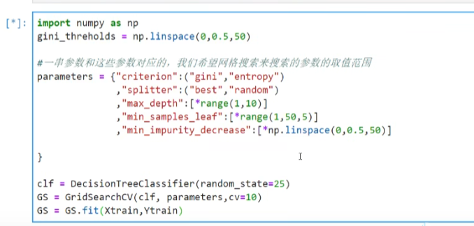

# 1 基本流程


## 1.1 交叉验证
将数据划分成n份，每次用n-1份训练，1份做验证，重复n次，取平均值。

cross_val_score()

## 1.2 机器学习经验


# 1.3 网格搜索
字典里面放参数，然后用GridSearchCV()来搜索。


结果：


# 1.4 集成算法
集成学习（ensemblelearning）是时下非常流行的机器学习算法，它本身不是一个单独的机器学习算法，而是通
过在数据上构建多个模型，集成所有模型的建模结果。基本上所有的机器学习领域都可以看到集成学习的身影


# 2 np的知识
## 2.1 随机数
np.random.RandomState和seed都可以设置随机数，但seed是固定随机数，RandomState是随机随机数。个人理解差别不大，就是seed设置了，后面所有的都得用seed的，RandomState每一截都可以设置不同的种子。


## 2.2 增加维度
ndarray = np.array([1,2,3])
ndarray.reshape(-1, 1)或者
ndarray[:, np.newaxis]

## 2.3 补np的知识
```python
import numpy as np
from scipy.special import comb

# comb(a, b)指排列组合里C(a, b)，即从a里选b个数的组合数
np.array([comb(25,i)*(0.2**i)*((1-0.2)**(25-i)) for i in range(13,26)]).sum()
```

# 3 pd的知识
## 3.1 查找
### 3.1.1 探索数据
df = pd.DataFrame(data)
df.info()和df.head()
### 3.1.2 看一下某列有哪几种数据
df['col'].unique()
### 3.1.3 从DataFrame中找到要训练和测试的X
X = df.iloc[:, df.columns != 'target']
y = df.iloc[:, df.columns == 'target']

## 3.2 删除
### 3.2.1 删除列
df.drop(columns=['a', 'b'], inplace=True, axis=1)
### 3.2.2 填充删失值
df['col'] = df['col'].fillna(df['col'].mean())
### 3.2.3 删除缺失值所在行
df = df.dropna(axis=0)

## 3.3 修改
### 3.3.1 把字符串数据改成0,1
把字符串变成数字，比如把性别改成0和1，label = data['sex'].unique().tolist()
data['sex'] = data['sex'].apply(lambda x: label.index(x))
或者
data['sex'] = data['sex'].map({'female':0, 'male':1})

### 3.3.2 把索引变有序
df.reset_index(drop=True, inplace=True)或
df.index = range(len(df))

# 4 matplotlib的知识
## 4.1 jupyter notebook中画图
通过%matplotlib inline 设置matplotlib环境