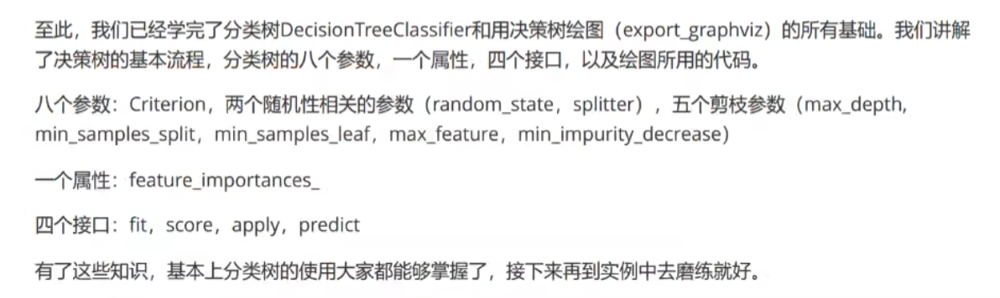
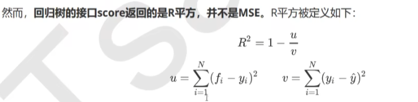

# 决策树
决策树分为两种，一种是分类树，一种是回归树
# 1. 决策树
## 1.1 关键问题
关键的两个问题
1. 如何从数据中找出最佳节点和最佳分支
2. 如何让决策树停止生长，防止过拟合

## 1.2. 衡量模型好坏的指标被称作不纯度Criterion，有两个指标衡量
1. 输入"entropy"，使用信息熵（Entropy）
2. 输入"gini"，使用基尼系数（GiniImpurity）

## 1.3. 决策树的流程


## 1.4. 总结



# 2.回归树
## 2.1 重要参数，属性和接口
### 2.1.1 criterion
1. 用来计算不纯度的函数，默认是“mse”，即均方误差（MSE）
2. mae 使用绝对平均误差
3. friedman_mse 使用friedman_mse

默认loss使用的是MSE，但是由于实际上优化需要，所以sklearn计算使用-MSE，即neg_mean_squared_error
### 2.1.2 接口score
返回的是R^2


## 2.2 实例
```python
# 实例化
regressor = DecisionTreeRegressor(random_state = 0)
# 交叉验证
cross_val_score(regressor, X, y, cv=10
# 默认返回的值是R^2，示例中返回的是MSE
，scoring='neg_mean_squared_error')


import numpy as np
from sklearn.tree import DecisionTreeRegressor 
import matplotlib.pyplot as plt

# 生成数据
rng=np.random.Randomstate(1)
x=np.sort(5*rng.rand(80,1),axis=0)
y=np.sin(x).ravel()
y[::5]+=3 *(0.5-rng.rand(16))
#np.random.rand（数组结构），生成随机数组的函数
#了解降维函数ravel()的用法
np.random.random((2,1))
np.random.random((2,1)).ravel()
np.random.random((2.1)).ravel()shape
```

