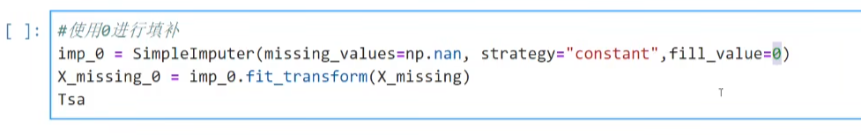

# 随机森林

# 1 决策树
## 1.1 重要参数
### 1.1.1 决策树参数
和决策数一样的参数


### 1.1.2 随机森林参数
1. n_estimators: 
树的数量，通常树值越大，精度越高，但是速度也越慢。到一定精度后就不会再提升。
查看森林中树的状况 rfc.estimators_[o].random_state

2. bootstrap参数:
要让基分类器尽量都不一样，一种很容易理解的方法是使用不同的训练集来进行训练，而袋装法正是通过有放回的随机抽样技术来形成不同的训练数据：bootstrap就是用来控制抽样技术的参数。
在一个含有n个样本的原始训练集中，我们进行随机采样，每次采样一个样本，并在抽取下一个样本之前将该样本放回原始训练集，也就是说下次采样时这个样本依然可能被采集到，这样采集n次，最终得到一个和原始训练集一样大的，n个样本组成的自助集。由于是随机采样，这样每次的自助集和原始数据集不同，和其他的采样集也是不司的。这样我们就可以自由创造

### 1.1.3 举例
实例化
训练集带入实例化后的模型去进行训练：使用的接口是fit 
使用其他接口将测试集导入我们训练好的模型，去获取我们希望获取的结果（score，Y_test）

```python
from sklearn.model_selection import train_test_split
from sklearn.ensemble import RandomForestClassifier
from sklearn.tree import DecisionTreeClassifier
X_train, X_test, Y_train, Y_test = train_test_split(X, Y, test_size=0.3)

clf = DecisionTreeClassifier(random_state=0)
rfc = RandomForestClassifier(random_state=0)
clf.fit(X_train, Y_train)
rfc.fit(X_train, Y_train)

score_c = clf.score(X_test, Y_test)
score_r = rfc.score(X_test, Y_test)

print(score_c)
print(score_r)

# 交叉验证
from sklearn.model_selection import cross_val_score
import matplotlib.pyplot as plt

rfc = RandomForestClassifier(nestimators=25)
rfc_s = cross_val_score(rfc, wine.data, wine.target, cv=10)

clf = DecisionTreeClassifier()
clf_s = cross_val_score(clf, wine.data, wine.target, cv=10)

plt.plot(range(1,11), rfc_s, label='RandomForest')
plt.plot(range(1,11), clf_s, label='DecisionTree')
plt.legend()
plt.show()
```

## 1.2 随机森林的原理
### 1.2.1 随机森林的本质是袋装集成算法，当XX棵树以上的树判断失误的时候，随机森林就会判断失误


## 1.3 随机森林测试：
 可以采用袋（bag）外数据进行测试，如果这样测试，如果希望用袋外数据来测试，则需要在实例化时就将oob_score这个参数调整为True，训练完毕之后，我们可以用随机森林的另一个重要属性：oob_score_来查看我们的在袋外数据上测试的结果

```python
无需划分训练集和测试集
rfc=RandomForestclassifier(n_estimators=25,oob_score=True) rfc=rfc.fit(wine.data,winel.target)
#重要属性oob_score. rfc.oob_score_
```

## 1.4 随机森林通用接口：
apply, fit, predict, score
新的额外接口，predict_proba()
# 训练效果
rfc.score(Xtest, Ytest)
# 特征重要程度
rfc.feature_importances_
# 返回每个树中的叶子节点索引，即决策树信息
rfc.apply(Xtest)
# 返回测试集预测的标签
rfc.predict(Xtest)


## 1.5 bag补充
红色为单个数，蓝色为随机森林，当单个数的准确率低于50%时，随机森林会更差，随机森林的每个分类树至少要有50%的准确率，这样随机森林才能用。


# 2 回归树
## 2.1 重要参数
1. criterion: 
mse, friendman_mse, mae
回归树接口score返回的是R^2

找打分表

## 2.2 回归森林接口
1.没有predict_proba() 回归不存在在哪个里面的概率

## 2.3 回归森林的例子
```python
regressor = RandomForestRegressor(
    n_estimators=100, # 树的数量
    , random_state=0, # 随机数种子
    )
cross_val_score(regressor, 
                boston.data, 
                boston.target,
                cv=10,
                scoring='neg_mean_squared_error', # 默认为R^2
                )
```

# 3 随机森林填补缺失值
使用sklearn.impute.SimpleImputer

```python
import numpy as np 
import pandas as pd
import matplotlib.pyplot as plt
from sklearn.datasets import load_boston 
from sklearn.impute import SimpleImputer
from sklearn.ensemble import RandomForestRegressor 
```

# 3.1 例子是波士顿房价数据集  
共506个样本，13个特征  
    
首先确认比例，假设为50%  
  
随机删除值  


1. 使用均值填补  
  
  
训练+导出  
#训练fit+导出predict >>> fit transform  

2. 使用0进行填补  

missing_values是指里面要补的缺失值
strategy是指填补的方式，有mean，most_frequent，constant, constant指用常数填补
fill_value是指用什么值来填补，当strategy为constant的时候，必须写上
X_missing_0就是训练加导出的数据

可以看到已经填上了

3. 使用随机森林机型填补  
思路的话是先用0填上，然后把其他特征值按照缺失值由少到多来随机森林算上  
X_missing_reg 是 X_missing的copy()    
首先看一下每个特征缺失值的个数，总共是13列  
